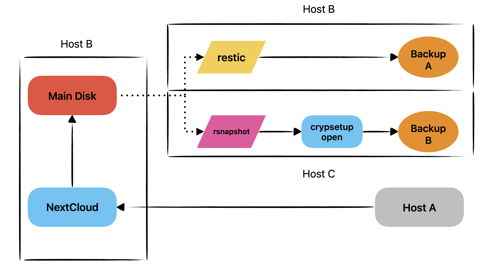

## Description

`multi-hop-backup` is a script designed to automate the creation of backups via SSH (multi-hop backups). It's ideal for environments where access to the hardware where the backups are stored is inaccessible, and for defining scheduled data transfers. It's also focused on low-capacity hardware.

## Features

- **Multi-hop backups**: Transfer data from source to final destination via SSH servers.
- **Cron jobs**: Allows running with a cronjob, allowing the program to perform periodic backups.
- **Use rsync**: Use rsync for greater efficiency in incremental data transfers.

## Requirements

```bash
- Bash
- OpenSSH Client
- Rsnapshot
- Restic
- crypsetup
```


For this case, Nextcloud can be ignored or add another administrator or keep the local disk, the goal is to make a local and remote copy, the opensnap and restic directory can be located in any direction, however, I would change the cron job directory, by default all scripts are in `opt`

Cron task structure

```bash
0 1,9,17    * * *   root  /opt/openalpha/open_alpha.sh >> /opt/opensnap/openalpha/log_openalpha 2>&1
```




----

## Configure

### Encrypted disk with unlock file

- Init encrypt disc with LUKS

```bash
sudo cryptsetup luksFormat /dev/sda 
```
 
- Create key file random for unlock disk
 
``` bash
sudo dd if=/dev/random of=/root/keyfile bs=1024 count=4
chmod 600 /root/keyfile. 
```

- Access disk with keyfile

``` bash
 sudo cryptsetup open /dev/sda hdd600 --key-file /root/keyfile
```

- Format disk unit for one first

```bash
 sudo mkfs -t ext4 /dev/mapper/hdd600.    
```

- Mount disk
```bash
sudo mount -t ext4 /dev/mapper/hdd600 /mnt/disk600GB/
```

### Automation from central host

**Generate keygen for host**

```bash
ssh-keygen -t rsa -b 4096
ssh-copy-id user@ip_host_C
```

In this case host B and host C create an id, and share your id for init session without credentials

If you ever believe your private key has been compromised, **revoke access to it** by removing the associated public key from the `~/.ssh/authorized_keys` file.

### Unlock Routine

```bash
$ ssh user@ip_host_C "sudo cryptsetup open /dev/sda hdd600 --key-file /root/keyfile"

$ ssh user@ip_host_C "sudo mount -t ext4 /dev/mapper/hdd600 /mnt/disk600GB/"

-->> ROUTINE FOR CLOSE DISK

$ ssh user@ip_host_C "sudo umount /mnt/disk600GB"

$ ssh user@ip_host_C "sudo cryptsetup close hdd600"
```
### Policy configuration (rsnapshot)

- In file rsnapshot.conf define the levels

```bash
#########################################
#     BACKUP LEVELS / INTERVALS         #
# Must be unique and in ascending order #
# e.g. alpha, beta, gamma, etc.         #
#########################################

retain  alpha   6
retain  beta    7
retain  gamma   8
```
- To define policies on restic, edit the cron task or run the manually
  
```bash

sudo restic -r restic/ forget --keep-hourly 7 --keep-daily 6 --keep-weekly 4 --keep-monthly 12 --keep-yearly 1 
```
### Check integrity
Use rclone for check integrity
```bash
rclone check /directory1 /directory2
```

rclone uses md5 by default for integrity checking, however this task can take hours depending on the number and size of files and hardware, for a quick but less reliable check, use `—size-only -P`, this reduces the time from hours to minutes, because it uses the size of the files for checking.

```bash
rclone check /directory1 /directory2 --size -only -P
```
